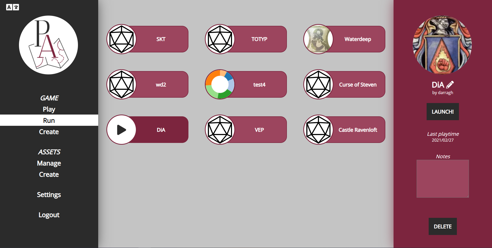
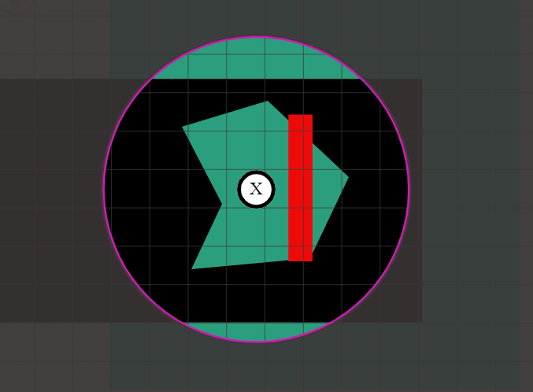

This release contains quite the variety in type of content, we got some UI redesigns, new tool options, quality of life changes and more!

Also worth noting is that release also contains contributions from multiple contributors on the discord server, special shoutout to scoodle and mischievous!

## Dashboard Redesign

We'll start with one of the most obvious changes, the dashboard!
The dashboard is the page you see after logging in and where you select the campaign you want to play/run.

This page is completely been redesigned and now looks like this:

### Menu

The left sidebar acts as a menu which gives you instant access to various views.

The first section of the menu is related to all things game related, play lists all the sessions that you are an active player in,
run gives all the sessions that you DM. Lastly the Create option allows you to create a new campaign.

The second part is related to all things assets. The Manage menu will open the asset manager, a component that was previously only accessible from within a game. The Create option here is not yet available, but will be revealed in a future release!

Finally we have an action to open the settings and to log out.

One important note: the settings and manager currently still open in their original components, but the intent is to redesign them to fit in this new dashboard UI.

### Run/Play

In run and play mode a second bar appears on the right that contains some more details about the currently selected campaign.

Noticeably new additions should be the ability to set logos (dm only), create small personal notes related to a campaign, to see the last time you played in that campaign and actions to leave/delete the campaign.

## Tools

### Erase floor mode (DM)

A new addition to the draw modes for the DM is 'erase' mode.

This special mode allows you to make areas on your current floor transparent, allowing you and the players to see what is happening on the floor below.

You could use this for sudden explosions that might open a hole in the floor or maybe you simply forgot to make something transparent in preprocessing and want to edit it in PA itself.

In the above image there are 2 floors.
The bottom floor contains a rectangle in a turquoise colour.
The upper floor contains all other shapes.

The polygon shape that roughly resembles a fat arrow to the right, is a shape that is drawn in erase mode.
It offers a look into the bottom floor.

This shape is part of the draw stack as any regular shape! As you can see the red rectangle is on top of this polygon shape as if there was a log crossing the opening in the floor. If you move the polygon to the front (or the red object to the back), only the red parts that are not covered by the polygon would be visible!

One last important aspect is that this shape automatically gets created on the map floor when drawn. There is however nothing preventing you from moving it to another floor.

### Text shapes

A pretty straight forward new addition to the draw tool, available for all, is the option to 'draw' text.

This first version is relatively simple, it offers a text prompt when you left click with this shape selected.
The shape can be rotated/resized as other shapes.

Expect some further enhancements in the future.

### Ping and Ruler size changes

The pings and rulers you drew, where always consistent in size.
However when other players draw them, their size was affected by the zoom-level they were on and not the one you were on.
This potentially resulted in some rulers appearing very thick or very thin on your screen or pings that are tough to spot.

This release changes the rules for these shapes and they will always be drawn at exactly the same size. The zoom level of you or the drawing person is no longer relevant for this decision.

### Spell cone icon update

A small QoL update is that the spell cone icon now is a filled cone.
Thanks to my friend Jiri.

## Settings

### Client Settings redesign

The dashboard was not the only UI that got a refresh, the client settings also got some new paint!

Instead of being part of the sidemenu, the client settings now open in a modal, just like the DM settings do.
This offers more breathing room and also more leeway for more options.

As part of this redesign, there now also is a concept of campaign-specific client settings.
When you change a setting, you'll notice two icons appearing next to it, which indicates that the setting deviates from the default settings.

The left icon resets the value to the global setting, whereas the right icon makes this new value the new global default.

In a later release the global settings will also be editable from within the dashboard-settings view.

### Disable scroll to zoom

An often heard complaint by players using touchpads is an option to disable the zoom tool to activate on scroll,
as this can very easily accidentally happen when using a touchpad.

This new option is now available in the client settings under behaviour!

### Co-dm option (DM)

As a DM you'll now be able to promote players to the co-dm role from within your main DM-settings.

## Shapes

### Defeated

Shapes only got a small change this release, and that is a 'defeated' property.
When you check this box in the shape properties or when you press 'x' with one or multiple shapes selected,
all affected shapes will get a red X drawn over them.

_This was contributed by scoodle on discord!_

## Load wall info (DM)

Another frustration some DMs sometimes have, is the arduous work related to drawing walls for the vision system.

This release adds 2 options to 'import' wall information from alternative sources.

### dungeondraft

Dungeondraft is a popular service to prepare your maps before importing them into a VTT.
They offer exports in a custom dd2vtt file format.

This format is now understood by PlanarAlly and when you drop an asset on the board that is such a file it will have that information attached.

For technical reasons the walls, doors and lights associated with the dd2vtt file are not immediately added to the scene.
Instead you can first resize/map the asset to a form you're pleased with and then load all the extra information by moving to the "Extra" tab of the shape's properties and clicking the 'Apply ddraft info' button.

All information is added to the board as proper PlanarAlly shapes, which means you can resize things, remove lights you don't need etc.

### svg

Another approach that is now available is to attach an svg with wall information to any asset. Similary to the dungeondraft files this can be done from the 'Extra' tab in the shape's properties.

**A very big warning**: keep these svg's simple or you'll be in a world of pain.

These svg's are intended to just contain wall information, so make sure to remove the walls, backgrounds etc before adding it.

A last word of note is that these walls are not interactable, they are purely internal to the shape, so you can't resize them etc at this point in time.

## Quality of Life

### The big red border

There will now be a big red border around the screen, when the connection to the server is interrupted.

Depending on the issue, the connection should auto-restore, but everything that you modified during the disconnect might be lost.
This was always the case, but it should now be clear to you when progress might be lost.

### Mac keybindings

All keybindings using the ctrl key will now use the cmd key on mac based computers.

### Font loading

The opensans font used in PlanarAlly will now be fetched from the server instead of google fonts.
This could otherwise lead to font issues when playing offline.

## Server

### Specify public host name

By default when a DM is shown the invite link in the DM settings, it uses the current browser URL to figure out the host.
When the DM is however connected through a local ip or localhost, the url will be unusable by other players.

A new server config setting allows you to set a `public_name` which if set will always be used as the root host.

## Notable bugs

### duplicate floor name (DM)

It is no longer possible to create a floor with a name that is already in use.
This could lead to multiple problems when interacting with the two floors.

This is a quick-fix, but shouldn't really impose too many restrictions anyway.

### token snap on wall leave

When as part of moving a token, you move your mouse into a wall, you could become desynced from the shape when you return from the wall.
This is now fixed.

### template drop non-default grid size

When dropping a shape with a template that contains size information on the board, but used a non-default grid size,
the shape would be wrongly resized.

### variant shapes showing up

When using the experimental variant feature, all players would be able to see any variant shape at all times.

### context menu offscreen

When opening a context menu on the bottom or right border of the screen, the content would fall off screen.
These menus are now aware of the borders and will retrofit accordingly.

### navigating backwards

When navigating backwards either using the browser back button or a button on your mouse, the URL would update correctly,
but nothing would change. This is now fixed.
