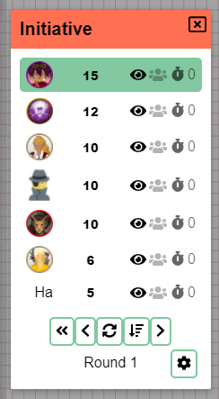
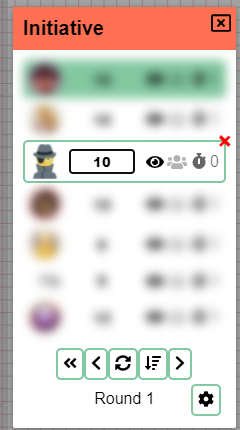
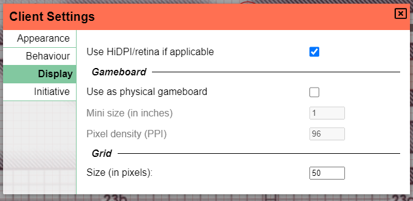

It's been a while since we had another release.
The good thing is that few bugs have been reported so the 0.26 release was pretty stable, which is always nice to see.
The bad news is that this release might be somewhat more rocky and we'll soon see why.

This release was primarily intended to do one thing and that's upgrading the reactive framework PA uses (Vue) from version 2 to version 3.
That's a very technical change that _ideally_ shouldn't have an impact on the user experience directly, but touches a lot of code which is the reason I wanted a longer period to verify if things behaved correctly. I'll cover in detail what the changes entail at the end of this article to not scare away the actual users! :)

But internal code changes isn't the only thing that changed, initiative got an overhaul, there are some new goodies for using PA as a physical gameboard and there have again been some wonderful contributions from the community. So let's dive in!

## Initiative

The initiative tool as it worked up until now has pretty much been hacked in a couple of days after a reddit comment asked about initiative support. It did the job, but always had some smaller issues. I finally took out the time to address these outstanding issues and rethink some of the initiative's functionality.

### UI/UX

One of the issues was that the UI could be very busy.
Definitely for players who always could see the admin buttons but not interact with them in any way.

#### DM bar

Actions that are DM only have been moved to a separate "DM bar" and will only be visible to (co-)dms.

#### Settings

Along with that the camera and vision lock icons have been moved to the client settings, which can be accessed with a small cog icon.
This also solves the "bug" where people who frequently use these settings would always need to reapply these configurations in the past.

#### Removal

Another noticeable change should be the removal of the trashcan from the icons for each initiative actor.
For something that is not _that_ important to be seen at all times it was taking up some space.
A small red cross will now appear instead in the top-right corner when hovering over an initiative actor.

#### Input field

Lastly the input value itself has been given more width. It now has some space to breathe!
It also has changed styling and no longer sticks out as this strange input box, but now looks like a "normal" element in the modal.

While inputting your initiative it's possible that you lose focus over the input field if someone else is simultaneously modifying values, causing the initiatives to jump around. This was addressed in the past, by waiting with refreshing the initiative window until after you've submitted your change. There was however no indication that showed that values were not synchronised if you still had the input field focussed. This isn't ideal as it's very unclear and could lead to a lot of confusion. That's why in the new initiative window, all other initiative rows will be blurred out while you have an input field focussed to visually show that you're performing an action that is not yet finished.

As a last quality of life change, pressing `enter` will now also work in the initiative input fields :).

### Behaviour

A second issue with the old initiative was that the sorting behaviour could become stuck, with the iniative order no longer updating or wrongly updating. The datastructure behind the scenes that was responsible for this has been changed and should now behave properly at all times.

The initiative DM bar also good new goodies:

You can now go back in the past, if you accidentally skipped someone or someone wasn't done with their turn.
You can now also clear all initiative values. This allows you to call for new initiative and see who still has to update their value, whereas otherwise you might not be sure if the value is new or still the old one.

#### Sorting

Lastly you can now also actively change sorting behaviour. The three options are: descending, ascending and manual.
If you drag initiative around the sorting will automatically change to manual mode, unless you swapped two actors with the same initiative value.

## Copy Locations

_Contributed by CalebKoch_

This nifty feature allows DM's to copy a location to another session. The concept is pretty simple, but saves a lot of work if you're running the same campaign for multiple groups and don't have to redo the entire mapping and drawing of fow!

It can be accessed as a DM from the location settings that you wish to copy from. A dialog will present you with all campaigns you have.

## Gameboard

This came partially as a request from the people over at the last gameboard with whom I've been partnering to bring PA to their platform,
but it has general use as well!

In most cases PA is used purely as a digital solution to tabletop gaming.
In this context it's firstmost the size in pixels that a grid cell should represent that is important.

In some cases, PA is used as an extension of "traditional" physical play and PA is thus used as a more traditional gameboard with extra features.
In this context, filling in pixel size directly is less interesting, but being able to put minis on the board is what is important.

It's now possible to define the size of the grid in a physical context by providing the mini size size and the PPI (somethings called DPI) of the screen. One consequence of this is that zooming makes no sense and this thus will not work for now.

## Viewport

As a DM you sometimes have your own DM screen but also control another screen that shows what players can see.
In this context it can sometimes be a hassle to switch screens/devices to control the camera of the players.

New in this release is the option to show the active viewport of players. In the Admin settings you can toggle on the viewport for individual players.

Each viewport will be rendered on the DM layer as a rectangle with no filling and whose border shows the exact region that player is watching at that point in time.

Each viewport can additionally be moved around by the DM, directly panning the screen on the related player.

<video autoplay loop muted style="max-width: 680px;">
   <source src="/assets/0.27.0/viewport.webm" type="video/webm">
   <source src="/assets/0.27.0/viewport.mp4" type="video/mp4">
</video>

_sorry for the artifacting, also bonus points to those who recognise the image in the background ;)_

## QoL

That was it for most bigger changes, but a lot of nice quality of life changes have been made as well!

### Asset menu sync

The asset menu side bar, only available to DMs for now, was never live updated when new assets were added to the asset manager.
This caused myself and multiple others a lot of pain everytime we had to reload the page after we added new assets.

No longer do we need to endure this, as the bar will now live update to what happens in the asset manager!

### Edit shape text values

Some shapes (i.e. Text & CircularToken) have a certain text valu associated with them.
In the past this value was only configurable during creation of these shapes and would not be modifiable afterwards.

A new 'value' row has been added to the properties tab of those shapes' edit dialogs.

### HiDPI/Retina

As you may have seen in an earlier image, the client settings has a new display tab.
It also contains a toggle to turn on support for HiDPI and retina screens.
This should make everything more crisp!

**warnings**:

-   This is heavier for your computer to draw
-   I've had some reports where zooming/panning goes awry with this setting activated, so be wary!

### ctrl deselect

Ctrl clicking shapes allows you to add individual shapes to an active selection. Other tools commonly also support ctrl clicking already selected shapes to deselect them. This is now also supported.

### kicking player confirmation

Kicking a player will now first ask for confirmation :)

## Server

### api server is now disabled by default

The API server is a very niche feature and was enabled by default which required an additional port to be open.
It's now been disabled by default to prevent arcane error messages for people running in containers with only the main port open.

### public_name commented by default

_contributed by dthv_

A small QoL change that makes it clear that this is an optional feature.

### Dockerfile changes

_contributed by jirsat_

Cleanup of some unused dependencies and support for ARM has been added to the dockerfiles.

## Fixes

-   A bug related to floors and lighting on higher up floors not updating
-   Reordering floors being rendered wrong until a refresh
-   Redo not working on Mac
-   Tracker bars with negative values showing a bar going to the left
-   Co-DM not seeing private initiatives
-   Removing last floor giving a blank screen
-   Removing floors below the active floor giving a blank screen
-   Setting a value < 1 for unitSize was possible

## Client rewrite details

As said in the introduction PA now uses Vue 3, which introduced the composition API which is more typescript friendly.

All UI code has completely been rewritten to make use of this new API.
Additionally all "stores" have been rewritten to use a custom written very simple state API that better fits my own needs.
This allowed me to refactor a lot of code that in the past was spread over pure ts files and a related store.

Another nice advantage of Vue 3 is that it now supports Map and Set in reactive contexts, which greatly improved some areas were I had to work with Maplike data in less ideal ways.
