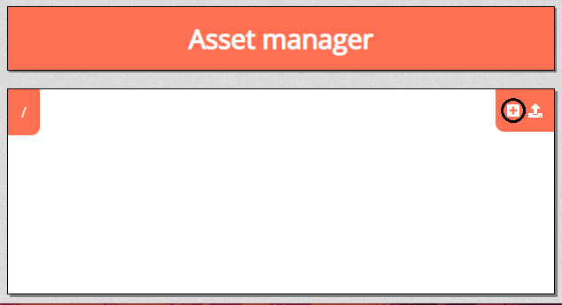
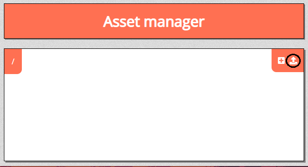
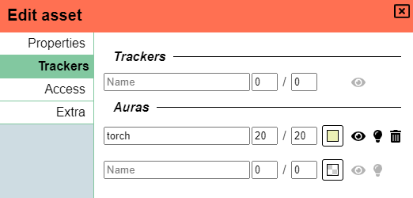
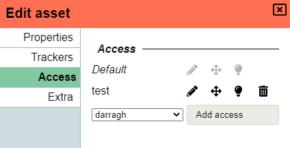
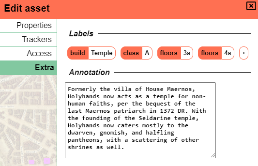

# Assets

The asset menu is used for inserting assets into your game.
These can be maps, tokens, objects, or anything else you wish to insert.
To access this menu, click the :icon="['fas', 'cog']"/> icon and click “Assets” from the dropdown menu.

## Asset Manager

If you’re just starting out, you will have no assets.
To add them, you will need to enter the Asset Manager by clicking .

### Creating Folders

To create a folder, click the create folder icon.
A dialogue box should appear where you can write the new folder name.
With the folder created, you can place your assets into the folder for easier navigation.

### Uploading Files

To upload files, click the upload files icon.
This will open your file system.
Choose the asset you wish to upload to your campaign.
Once uploaded, your files will be accessible in-game.

When multiple files are selected a progress bar will be visible to update you on the state.

## Placing Assets

To use your assets, first open the asset tab.
Then, open the folder where you have stored your files.
Last, drag the asset onto the game board.
Your asset will now be able to be manipulated.

Alternatively, you can also search for an asset using the search bar.
This will filter out folders and subfolders that have no items matching your search query.

### Templates

At any point you can persist the state of an asset from the right click context menu.

This state includes default properties but also trackers, auras and dimensions (width and height).

When you drop an asset on the board that has templates associated with it, you'll get a prompt to choose a template instead of the base empty preset.

<video autoplay loop muted style="max-width: 680px;">
   <source src="/assets/0.23.0/templates.webm" type="video/webm">
   <source src="/assets/0.23.0/templates.mp4" type="video/mp4">
</video>

This can be very handy to reuse some tokens you frequently use to prepopulate things like HP and light sources.
This will also be key to sharing sets with other players.

## Manipulating Objects

Selecting/interacting with objects is primarily done through the [select tool](/docs/tools/select/).

When the shape is selected, you may also use your arrow keys to move it.
As the DM, holding down shift lets you move shapes through movement-blocking terrain.

### Context menu

Right clicking on a shape will give you a list of options.
The options presented will be different depending on whether you are a DM or not,
but also on the state of the token (e.g. Add vs Show initiative).

The list presented above is the DM view.

#### (DM) Floor/Layer/Location

Hovering over the Floor/Layer/Location options, will open a submenu allowing you to move the selected shape to the selected option.

For more information, check the [floors](/docs/dm/floors/), [layers](/docs/dm/layers/) or [locations](/docs/dm/locations/) documents.

#### Move to Front & Move to Back

These options place your shape at either the front or the back of the active layer stack.
This allows you to place multiple objects on the same layer but have them overlap in specific ways.

#### Add initiative or Show initiative

This option places tokens in the initiative menu.
If already in the initiative menu, this will appear as “show initiative”.
For more information, check the [initiative](/docs/tools/intiative/) document.

#### Delete shapes

This option deletes the selected shape(s).
You may also press `Del` or `Backspace` to do this.

#### Set marker

This option sets the shape as a marker.
See [markers](/docs/player/markers/) for more information.

#### Show properties

This option opens the “Edit asset” menu, described below.

## Edit asset

By right clicking and selecting the “Show properties” option, you open the “Edit asset” menu.
This menu includes a plethora of options.

This dialog consists of muliple panels.

### Properties

The properties panel consists of common properties related to the shape in question.

#### Name

The name of the shape, this is an optional field that defaults to 'Unknown shape'.

The <font-awesome icon="eye"/> symbol is used to toggle whether other players without edit access are allowed to see this name.

#### Is a token

Selecting this option classifies the object as a token.
Tokens have a specific meaning, see [tokens] for more information on what this entails.

Check the [lighting and vision](/docs/dm/light-shadows/) document for more information on how lighting works in relation to tokens.

This should only be used for player controlled shapes.

#### Is invisible

Selecting this option turns the shape invisible to all players, except those with vision or edit access to the shape.
As the DM, you will still be able to see the shape.
This can be useful for having objects that are invisible but player-controlled, or invisible, but still affecting movement.

There is currently no special indicator to inform a user that their shape is invisible.

#### Border colour & Fill colour

As the names suggest, these options affect the colours of the shape.

Note that in some circumstances these colours are not used (specific shapes).

#### Blocks vision/light

Selecting this option blocks vision and light from passing through the shape.
More information about lighting can be found in the [lighting and vision](/docs/dm/light-shadows/) document.

#### Blocks movement

Selecting this option prevents other shapes from moving through it.
This is useful for creating walls in your dungeon you don’t want your players to pass through.

For the DM, you may still pass through shapes that have this option enabled.
To do this, hold down `shift` and move the shape.

#### Is locked

Selecting this option locks the shape in place.
This can be useful for maps you don’t want to accidently move while playing.
Press `Ctrl + L` to do this without opening the Edit asset menu.

#### Show badge

Selecting this option displays a badge at the bottom right of the shape.
By default, the badge number is 1.
As you copy and paste this shape, the badge number will increase incrementally.

This option is key for situations where you have large groups of repeated tokens, such as enemy encounters repeating the same enemy.
If all creatures have the same icon, it is difficult to track.
Enabling this option ensures the players and the DM do not lose track of who's who.

### Trackers

This panel is used to add trackers and auras.
These values often dynamically change throughout a game.

You can at all times see the values of both trackers and auras of a selected shape at the right hand side of the screen,
without opening the edit dialog.

Additionally you can modify these values from this quick info panel, by clicking on their value.
A small popup will appear in which you can insert a new value.
This value can be absolute, or relative by providing an input with a `+` or `-`.
For example, if the base value is 13, and you type `-5`, you will subtract 5, leaving you with 8.

#### Trackers

Trackers can be used to keep track of various states.
Common usages are for example HP, NPC attitude or arrows used.

A tracker consists of a value and optionally a name and a secondary value.
The second value can be used to denote a maximum (e.g. HP 20/40).

By clicking the <font-awesome icon="eye"/> symbol, you can toggle whether this information is public to all players or strictly visible to the DM and players with edit access.

#### Auras

Auras are similar to trackers, but have a visual impact on the board.
The 2 input values are used to delineate a circular aura on the board.
With the first value representing the bright aspect and the second value the dim aspect.

They have 2 additional fields compared to trackers: a colour box and a <font-awesome icon="lightbulb"/> icon.
The colour field can be used to give your aura some colour.

When the lightbulb is toggled on, it signals that the aura is a light/vision source.
More information about lighting can be found in the [lighting and vision](/docs/dm/light-shadows/) document.

Common examples are a torch which is a publicly visible light that shes 20/20 yellowish light and
darkvision which is a private lightsource that is typically 30/30.

### Access

Here is listed the players who have access to the shape.
Selecting a player name and “add access” will allow them to interact with the shape.
Selecting any of the icons next to “default” gives all players access to the shape.

Enabling <font-awesome icon="pencil-alt"/> allows those with access to edit the shape.
This access type automatically includes movement and vision.

Enabling <font-awesome icon="arrows-alt"/> allows those with access to move the shape unless locked.
This access type automatically includes vision.

Enabling <font-awesome icon="lightbulb"/> allows those with access to see the private auras/lights the shape has.

### Extra

This panel contains some settings that do not fit in any of the other places.

#### Labels

Labels are used to assign some context to a shape that can be used either purely for informational reasons,
or to filter on using the [filter tool](/docs/tools/filter/).

To add a label press the + and the label manager will open in which you can select an existing label or create a new label.

#### Annotation

Annotations are a freeflow place to write down information you want to track on a shape.
**This field is markdown aware!**

Additionaly, when hovering over a shape\* with an annotation, the annotation will be displayed on the top side of the screen.

_\*Only shapes you have edit access to._
