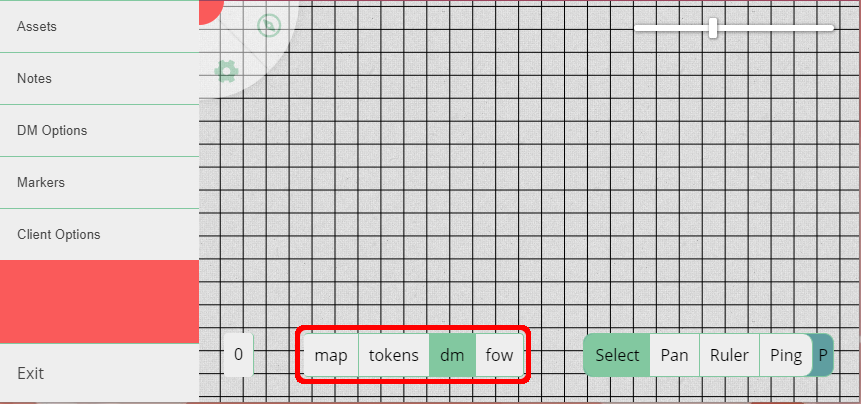

# Layers

PlanarAlly orders its game board in multiple layers.
They are drawn on top of each other.
These multiple layers produce the result you see when playing.

These layers each have a dedicated use.
It is important for the DM to understand the purpose of each.
For a quick reference on each layer, check the [quick reference](/docs/reference/) document.
For more in-depth details, continue reading!

Except for the DM layer, all layers are also drawn on the players' boards.
However, they can only interact with elements on the tokens layer.

_Currently these layers are hardcoded, but I do foresee a possibility to tweak this to your own preference in the future._

## Map

At the bottom of the draw stack is the map layer.
This layer is for placing maps, building layouts, and so on.

This layer is drawn below the grid layer.
This allows you to align your gridlines to your various dungeons.
Otherwise this layer behaves the same as the tokens layer.

## Grid

This layer cannot be manually selected, but it can be configured using the [DM Options Menu](/docs/dm/settings.md).
This layer draws gridlines on the screen.

Those gridlines are either squares (default) or hexagons.
Both flat-top and point-top hex-grids can be drawn, yet are only experimentally supported, right now.

:::warning Experimental
Hex-grids are experimental, so weird behavior may occur regularly.
One example is grid snapping that still works with square grids, despite a hex-grid being displayed.
:::

## Tokens

The core gameplay will happen on this layer.
It is the place where players and non-player characters move around.
You'll often have this layer active.

## DM

This layer is only accessible to the DM.
Players will not see anything on this layer.
This can be used to plan encounters in advance.
It can also be used to place text labels to remember key information.

You are also able to change the layer of a shape.
By hiding assets that players aren’t supposed to see yet on the DM layer, you can ensure that your players do not see information preemptively.

## FOW

This layer has some special behavior that helps with vision.

When you're drawing your walls, you want them to be static.
You don’t want them to change, as your players may see sections of the map they aren’t meant to yet.
By drawing walls on the vision layer, you make sure that when interacting with the tokens layer, you don't accidentally move a wall.
Therefore, this layer performs two magic tricks automatically for you.

Most shapes you draw on this layer will be used for walls or doors, so shapes drawn on this layer are automatically drawn with the 'blocks movement' and 'blocks vision' settings applied.
‘Blocks movement’ prevents players from moving through these shapes.
‘Blocks vision’ prevents players from seeing through these shapes.
You can deselect these options if you don't need them, but know that they will be applied by default on this layer.

**Everything** drawn on this layer is invisible on other layers.
This is because typically your map will already have walls pre-drawn.
When you draw an ugly black rectangle to tell the lighting system about a wall, you don't want to have to see that ugly blob when you're on the tokens layer.

This layer is purely for convenience.
If you don't like the automatic settings or the invisible aspect, you can use the tokens layer and draw your walls there with any setting you desire.
