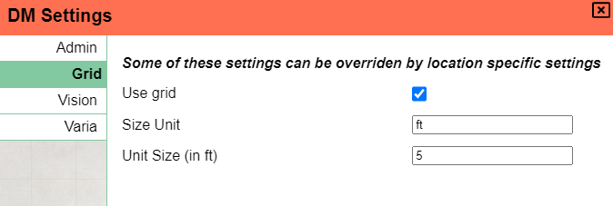

# Campaign Settings

As the DM, you’ll have a special window of options.
These allow you to configure the settings of the active campaign.

The DM settings are accessible from the side menu (click the <font-awesome :icon="['fas', 'cog']"/>-icon on the upper left screen of your browser window to open the menu).

## Admin

The admin section provides administrative options.

### Players

In the players section, you can see a list of current players.
Next to the individual player's name, you can set their role within the campaign.

:::warning Caution!
Setting any Player to be DM grants them **unrestricted** access to the **entire** campaign!
:::

Click “kick” to remove specific players from your campaign.

### Invitation URL

The Invitation URL allows you to invite players to your campaign.
To the right of the URL is a button that copies the URL to your clipboard.
Press “Refresh invitation code” to refresh the URL.

### Lock Session

The Lock this Session button locks or unlocks the campaign.
When locked, only the DM can access the campaign.
This feature is useful if you want to edit your maps and ensure none of your players start nosing around during your work.

### Remove Session

Remove Session **PERMANENTLY** removes the campaign from the PlanarAlly server. All data will be unrecoverable. **USE WITH CAUTION!**

## Grid

The grid settings offer you the ability to tweak the grid settings or even disable the grid all together.
These settings are the Campaign defaults that can be overridden in the [individual Location Settings](/docs/dm/locations/#grid).

### Use Grid

Enable or disable the grid. This applies to all players as well.

### Size Unit

The size unit allows you to change the default representation of units in ft (the dnd norm) to something else.
This could be used to change everything to meters (including fractions, e.g. for the dnd standard of 1.5&nbsp;m equalling 5&nbsp;ft), but could also be used to have one location with a world map scaled in kilometers or miles.

### Unit Size

Unit Size is the distance one grid cellrepresents in your game system. When you use the ruler tool to measure distances, this info will be used to make the conversion.

## Vision

Vision is one of the most important settings for the DM.
These settings allow you to change what players see and how they see it.
They are also referenced in the DM section on [lighting and vision](/docs/dm/light-shadows/).

The settings defined in this dialogue are the Campaign defaults that can be overridden in the [individual Location Settings](/docs/dm/locations/#vision).

### Fake Player

Fake Player is a DM toggle to render the board as if you were a player instead of the default DM mode.  
You'll still have access to some DM tools, but vision is calculated as if you were a player.
This way, you can verify what players will see.

If you have multiple players, you may choose which player you see the perspective of.
The vision tool (in the tool bar) allows you to select which of the players in the session you want to mimic.  
This can be just one player but can also be a group of players.

_Currently, there is no keybinding to toggle this mode or visual cue for when you're in fake player mode. This is planned for a future version of PlanarAlly._

### Fill entire canvas with FoW

_FoW stands for Fog of War_

With this option enabled, everything on-screen is hidden for players by default.
Lights need to be added to grant vision in areas.

With this option disabled, everything on-screen is shown to players by default.
FoW needs to be added to remove vision in areas.

:::warning
It is strongly recommended to fill the screen with fog if you want to use the vision system.
Currently the vision system without fog behaves funky.
:::

### Only LoS

_LoS stands for Line of Sight_

This option toggles an advanced mode of lighting.

When disabled, every location on screen with a light source will be visible.
It doesn’t matter whether a player is in that location or not.

When enabled, only things in Line of Sight of player tokens will be visible on screen.
A player needs to see the light in order for it to show up on the screen.

See the [lighting docs](/docs/dm/light-shadows/) for more information on this topic.

### FoW Opacity

This setting allows the DM to choose what the opacity of hidden areas is for the DM.
Players will always have this setting as 1.0 for themselves and cannot edit this.

In fake player mode, you'll also be stuck on 1.0.

### Vision Mode

:::warning
This is a technical setting that you should only touch if you know what you are doing.
:::

The experimental vision mode calculates the lighting/vision differently compared to the default version.

In the experimental version, changes to light/vision are done incrementally instead of a full recalculation on every change. The benefits are very obvious, the consequences are that it is less tested and in case of errors it could completely get stuck.

You could consider using this option, if you have many light/vision related objects on your map and experience slow updates of the screen when moving things around.

### Minimal/Maximal vision

These settings are tuning factors to the [vision system](/docs/dm/light-shadows/).
They determine limits to the vision of all tokens.

Suppose there is one giant, open field that stretches 5000 ft. and is completely illuminated.
One could expect the entire area to be visible to your token standing in the middle of this field.
There are, however, limitations to the human and nonhuman eye, hence the introduction of these settings.

Everything up to the minimal vision range can be seen as usual.
Everything past the maximal range cannot be seen and is fog of war.  
Everything in between is shown in an increasing opacity as you go further towards the edge of vision.
