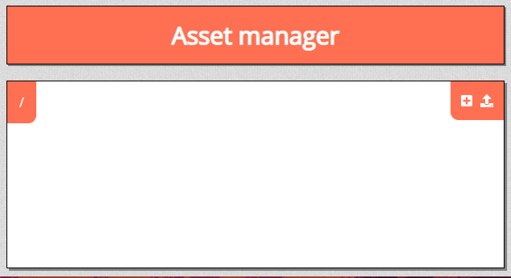

# Assets

The asset menu is used for inserting assets into your game.
These can be maps, tokens, objects, or anything else you wish to insert.
To access this menu, click the <Cog /> icon and click “Assets” from the dropdown menu.

## Asset Manager

If you’re just starting out, you will have no assets.
To add them, you will need to enter the Asset Manager by clicking .

### Creating Folders

To create a folder, click the create folder icon.
A dialogue box should appear where you can write the new folder name.
With the folder created, you can place your assets into the folder for easier navigation.

### Uploading Files

To upload files, click the upload files icon.
This will open your file system.
Choose the asset you wish to upload to your campaign.
Once uploaded, your files will be accessible in-game.

When multiple files are selected a progress bar will be visible to update you on the state.

### Downloading Files

To download files, select the asset(s) you want to download and click the download files icon.
This will open a download dialogue, providing you with a single `*.paa` file (the extension meaning **p**lanar **a**lly **a**sset).
They will unpack into any compatible PlanarAlly instance once uploaded like any normal asset.

Downloaded assets will keep folder structure and file names of your assets as well as any information saved to a [template](#templates).

## Placing Assets

To use your assets, first open the asset tab.
Then, open the folder where you have stored your files.
Last, drag the asset onto the game board.
Your asset will now be able to be manipulated.

Alternatively, you can also search for an asset using the search bar.
This will filter out folders and subfolders that have no items matching your search query.

### Templates

At any point you can persist the state of an asset from the right click context menu.

This state includes default properties but also trackers, auras and dimensions (width and height).

When you drop an asset on the board that has templates associated with it, you'll get a prompt to choose a template instead of the base empty preset.

<video autoplay loop muted style="max-width: 680px;">
   <source src="/blog/release-0.23/templates.webm" type="video/webm">
   <source src="/blog/release-0.23/templates.mp4" type="video/mp4">
</video>

This can be very handy to reuse some tokens you frequently use to prepopulate things like HP and light sources.
This will also be key to sharing sets with other players (see [downloading files](#downloading-files) above).

### Variants

<Warning title="Experimental!">
This feature is experimental! Some cornercases are expected to appear, so please [report to the issue tracker at GitHub](https://github.com/Kruptein/PlanarAlly/issues) if you encounter any bugs!
</Warning>

You can add _variants_ to objects in order to give them a different appearance without having to create a new token and removing the previous one.
Popular use cases would be a druid's wildshape, alternate art for characters, multi-stage bosses, surprise reveals etc.

To add a variant, use the `+` button at the bottom of the base object's edit window.
By clicking on the pencil <PencilAlt/>, you can edit the name of the active variant.
Note that the name of a variant is not connected to the name of the object!

While the base object can be any shape (Shape, Token, or Asset), only _assets_ can be added to them as variants.
At any time, only one variant of an object is visible and can be swapped out for another one.

Each variant retains its own size, properties, trackers, and auras
Trackers and auras can be configured to be shared among all variants.
A newly created variant will not have any of the applied settings the base variant has.
This includes access rights, general shape properties (e.g. name, `is a token`, etc.) or annotations!

<video autoplay loop muted style="max-width: 680px;">
   <source src="/blog/release-0.24/variants.webm" type="video/webm">
   <source src="/blog/release-0.24/variants.mp4" type="video/mp4">
</video>

You can delete a variant using the trash <TrashAlt /> button.
