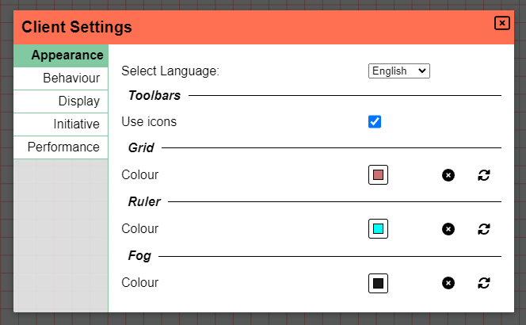
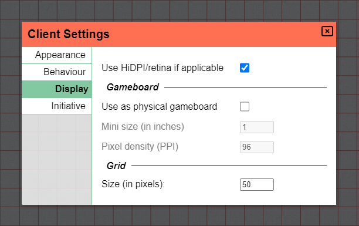
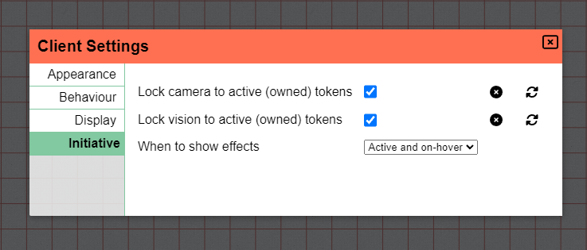

# Client Settings

The in-game settings are accessible from the side menu (click the <Cog />-icon on the upper left screen of your browser window to open the menu).

#### Setting synchronization

By default settings shown immediately derive from your default global client settings.
When changing a setting two extra buttons will appear next to it, to indicate that this setting is overriding default behaviour.

You can reset the setting to the default value by clicking the <TimesCircle /> icon.

If you instead want to make your change the new default value, you can click <SyncAlt />.
This will impact all other campaigns where you did not override this setting.

## Appearance

### Language

Here, you can choose a different language to be displayed in the user interface.
This will replicate to all other campaigns you play or run, just as if done through the [dashboard](/docs/dashboard/#localisation).

### Grid

The colour setting defines in what colour the [grid layer](/docs/dm/layers/#grid) (i.e. the grid lines) will be drawn upon the [map layer](/docs/dm/layers/#map).

### Ruler

Here, the colour of the [ruler](/docs/tools/ruler) can be set.
If the ruler is used publicly, all other players will see your ruler in the colour you defined here.

### Fog

This sets the colour for the fog covering everything you can't see.

## Behaviour

### Snapping

When checked, this inverts the default [snapping behaviour](/docs/game/snapping/).

### Mouse & Gestures

By default scrolling allows you to zoom in or out, this however can be annoying on touch devices and can thus be disabled.

## Display

The HiDPI setting allows you to increase the resolution of the rendered game on screens that offer subpixel rendering.

<Warning title="Increased Performance costs">
Enabling this setting will require more performance from your computer.

If the game feels laggy you want to make sure this is not enabled.
</Warning>

### Gameboard

If you use PlanarAlly on a screen that you use as a physical game board with real minis,
you'll want to configure these settings to configure the grid size correctly to match your minis.

You do need to know the PPI of your screen for this to work properly.

Note that zooming in/out is disabled when this setting is active.

### Grid

When _not_ using a physical board, you can configure here how big a single grid cell is supposed to be on your screen.

You'll want to change this if you're playing on something like a projector for example.

## Initiative

### Lock Camera

By enabling this feature, every time the initiative moves to the next character,
the camera will automatically center on this character if you have access to it.

### Lock Vision

By enabling this feature, the vision will be limited as if you only had access to the active initiative character (as long as you have access to that shape).

This is the same behaviour as if you used the [vision tool](/docs/tools/vision/) and is thus only relevant if you control multiple characters.

### Effects

This setting allows you to configure when initiative effects should be displayed.
By default only the active actor's effects are expanded, but you can change this to all actors at all time.
