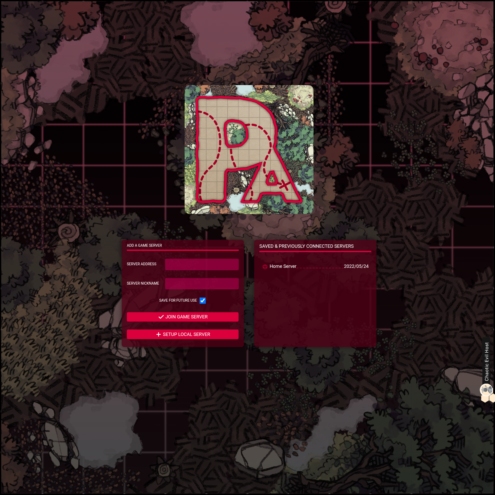
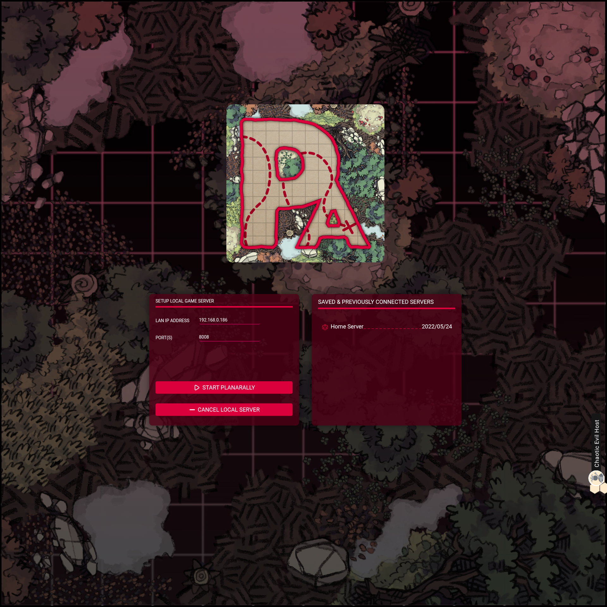
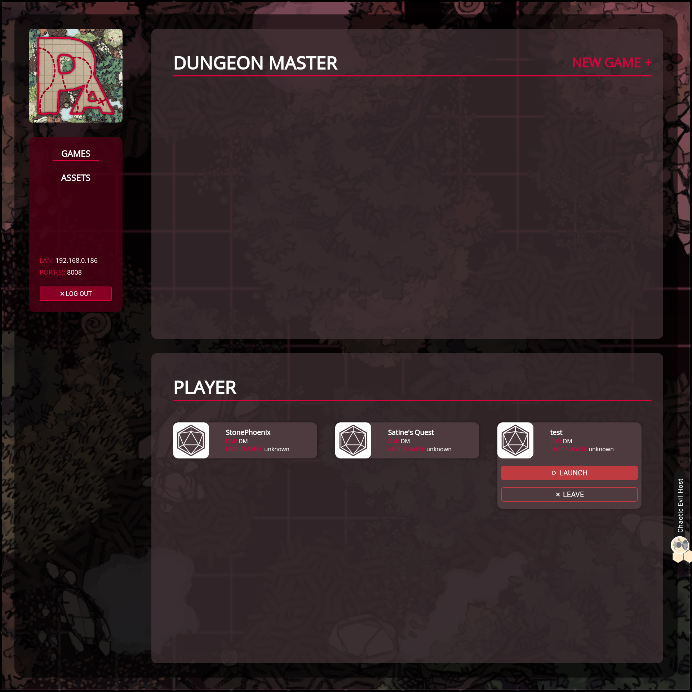

# Last Gameboard

PlanarAlly integrates with [the Last Gameboard](https://lastgameboard.com/),
a hardware solution with touch support to play games on a table.
This allows PlanarAlly to offer immersive lighting and shadow while still being able to use your physical minis!

The board allows you to play on any PA server[^1].
The board is also able to run a local PA server.

<Info title="New to PlanarAlly?">
This document only goes into the details to get up and running with the gameboard and some PA features that are unique to the board.
If you are a new PlanarAlly user, you will most likely want to checkout the other documentation and especially the DM will want to check the short segments in [the learn category](/learn/).
</Info>

## Setup

There is nothing special you need to do to enable gameboard support on PlanarAlly.
PA will simply be available in the list of games the gameboard offers.
You might notice it having a different icon than the one you're used to though ;)

When starting the PlanarAlly application on the board, you'll first be greeted by a screen in which you choose the server you want to connect to.
Here you can fill in the address of the PA server you want to connect to and give it a nickname.
On the right a list of servers that were previously entered are shown for easy access.

Upon either clicking on an entry in the right column or by joining a new server, the connection to the server will be started.
You should soon be greeted with the login screen for the chosen server if everyting went right.

<Info title="Login accounts">
To use PlanarAlly you need an account. You will usually need at least 2 accounts, 1 for the DM and 1 account for logging in on the board.
The DM is then responsible for creating a campaign and inviting all the players (or the board account).

These accounts are server specific and are thus not shared between servers.
</Info>

### Local Server

You also see another button "Setup local server" in the screenshot above, this is the place where you can configure a local server, allowing you to play without an internet connection!

This section shows you the IP address and port that will be used by PA, allowing other devices (e.g. a DM laptop) to connect as well.
If devices/players from outside your network want to join, you'll need to forward the correct ports on your router like you would for a traditional non-gameboard server.

<Warning>
In order to run the local server, you need to install the PlanarAlly Server application, which can also be found in the main games listing on the gameboard. Just installing it is enough, you don't have to "play" it.
</Warning>

<Warning title="Save file">
If you ever uninstall/reinstall the PlanarAlly server application, your save file might be lost.

Updating the server to a newer version however, should work without issues.
</Warning>

## Dashboard

Upon succesfully loggin in to a server, you'll be greeted with the dashboard from which you can join/launch games.
Although the looks are different, you should be able to find all the information you need in the [main dashboard docs](/docs/dashboard/).

<Info title="Dashboard looks">
If you used PlanarAlly before you might notice that the dashboard has a different UI compared to the main PA dashboard.
This is because the gameboard version is using a new UI that should be pushed to the main PA codebase soon!
</Info>

## Gameboard Features

Let's now look at what kind of gameboard features/integration PA actually has!

### UI

The UI/UX in-game (on the board) is slightly changed compared to the main PA UI. Some are small changes like bigger icons or text, others are a bit more noticeable.

The toolbar (bottom right) has a more limited amount of tools and is also missing the mode switcher.
This is due to some tools not being touch friendly yet, making it kinda awkward to include in the listing.
The popout modals to configure tools are also still hidden for the time being.

Do note that the other tools, unless they don't fit the flow of playing on the board, will be coming properly in the future!

Another thing you might notice is that although the toolbar got trimmed down, it also actually has a new tool: Minis.

### Minis

The most obvious feature to support on the gameboard: Minis[^2]!

#### Attaching

You should be able to put a mini on any shape that the user logged in on the board has access to. This will attach the mini to that shape.
If you now move around the mini, it should also update the position of the shape!

You can attach to a different shape by putting the mini on another shape as long as the original shape is not in the same spot.

#### Rotation

Similarly to movement, the gameboard can also detect shape rotation. If you rotate your mini and use a light source that is directional, you should also see the light rotating around!

### Dice

<Warning>
Dice rolling is still a relatively new feature in PlanarAlly and requires some further polish.
</Warning>

If you use the gameboard companion app, it will automatically show a dice roller when you join a game. Dice rolls initiated from the companion[^3] will appear and roll on the board!

[^1]: Currently the gameboard integration code is still being tested in a private repository, but it _should_ be merged to the main PA codebase soon.
[^2]: Those that have a conductive base the board recognizes.
[^3]: This can be accomplished by swiping the dice towards the board.