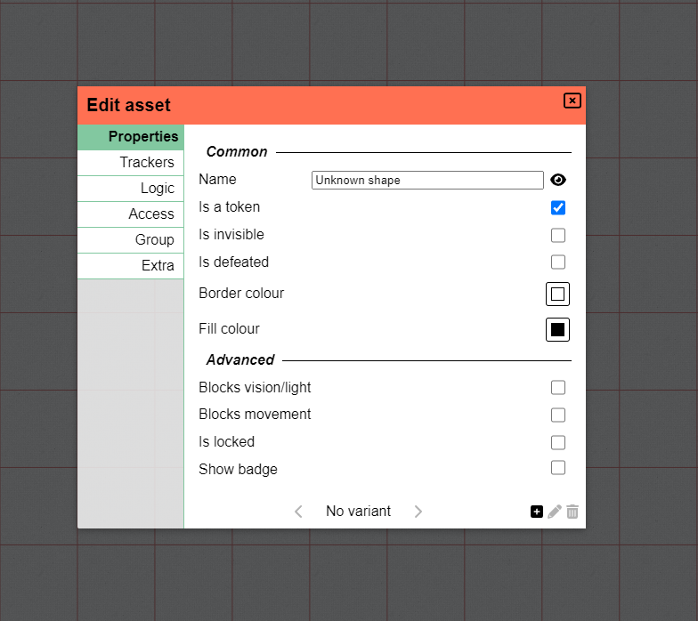

# Common tools

PlanarAlly packs a bunch of tools for your convenience.
Some of these are used often throughout a session, some are more exotic.

This section will just give a brief overview, for a more detailled explanation of most tools, visit the [tools section](/docs/tools/select/).

## Toolbar and mode

Most tools can be found in the bottomright on the 'toolbar'.
Simply clicking on the various names will open the tool and might even open some additional UI to interact with.

At the end of the toolbar in a different colour is the "mode switcher".
Because not all tools are needed at the same time, the concept of a toolbar mode was introduced and currently consists of two modes: "Play" and "Build". The idea is that most tools in Play mode are relevant during normal play, whereas the build mode tools are more relevant to the DM during prep, but can also sometimes be whipped out during active play.

You can freely swap between these two at any time by clicking on the mode switcher or using the `tab` keybinding.

Some tools are only available in a certain mode, and some tools are available in both but with some extra functionality depending on the mode.

## The camera

Before interacting with our characters, it's always good to get a feel for how to move the camera around.

The primary interaction with the camera are the pan and zoom tools.

### Pan

The pan tool is one of the dedicated tools available in the toolbar.
When selected you can simply press your left mouse button and drag the screen around.

<Tip title="Pan from any tool">
You can also pan by holding down the middle mouse button!
</Tip>

### Zoom

The zoom tool is not part of the toolbar but is a separate UI element in the topright.
When using the zoom tool it will always zoom in relation to the center of the screen.

This in contrast to using the other way to zoom: the scrollwheel.
This will always zoom in relation to where your mouse cursor is.

### Other

Although pan and zoom are your bread and butter, there are some other things that will change the camera location that are more advanced features, but we'll briefly mention them.

Pressing `space` will center the screen on your token\* or if you have multiple tokens, it will cycle through them.

Pressing `ctrl+0` or `numpad 5` will center the screen on the (0, 0) origin.

[Markers](/docs/game/markers) allow you to jump to a certain token immediately from the sidemenu.

_**\*token** has a very specific meaning in the context of PlanarAlly [See terminology](/docs/terminology/)._

## Interacting with your character

_For the sake of brevity, it's assumed in the following text that you have full access to the shapes we're interacting with. For more info on access check the [shape properties](/docs/game/shapes/#access)._

The most common interaction is ofcourse interacting with your character(s)!

The goto tool for this is the select tool.
This swiss-army knife is the default tool that will be selected during general gameplay.

<Info title="Mode behaviour">
The select tool has extra functionality while in build mode.
Specifically resize and rotate operations are only accessible from build mode.
</Info>

With the select tool you can either select individual shapes, or draw a selection box to select everything in a certain area.

### Movement

With shapes selected it's just a matter of clicking on one of them and dragging them, to move them around.

<Warning title="Grid snapping">
When moving/resizing/rotating and many actions, PlanarAlly by default will try to snap your action to a grid line.
This can be overriden by pressing the ALT key. The behaviour can also be inverted in your client settings.
</Warning>

### Quick info

WHen you have something selected, an extra UI element appears in the top right, below the zoom slider.

This panel gives some quick information about your or other characters.
The name and any tracker or aura you have configured can be immediately seen here and modified.

Additionally a quick action button to open the shape properties and to lock the shape in place are also available in this menu.

### Shape properties

There are various things you can configure for your character, things like your name, light auras and access rights can all be configured from the main "shape properties" modal.

To access this modal you can right-click on your character and it will open a small context menu with some other actions.
Right at the bottom there is a "show properties" action that will open the following screen.

Some of these should be pretty self-explanatory, for all the details go check out [the shape properties](/docs/game/shapes/#shape-properties).

Be sure to check-out the trackers section!

<Tip title="Quick open">
If you need to open this menu frequently, you can cut some time by either clicking on the <Edit /> icon in the quick menu (top-right) or even quicker by just pressing the enter key.
</Tip>

## Ruler

A last tool I would like to handle here is the ruler.

An often required task in many rpg systems is knowing how _far_ something is.
Sometimes you use theatre of the mind, but for those that require more precise info, a ruler tool is provided that can do the work for you.

When the ruler is selected, you can simply click somewhere and start dragging and the distance will appear.
By pressing the space bar you can start an extra ruler from your current point, to measure around corners too!

The select tool also got some distance features, for when you're moving your token, so make sure to check that out as well.
